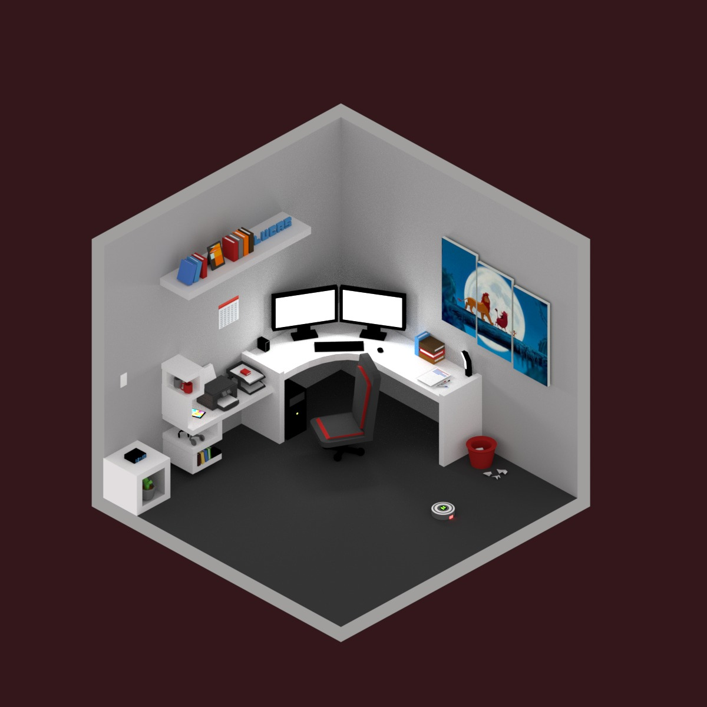
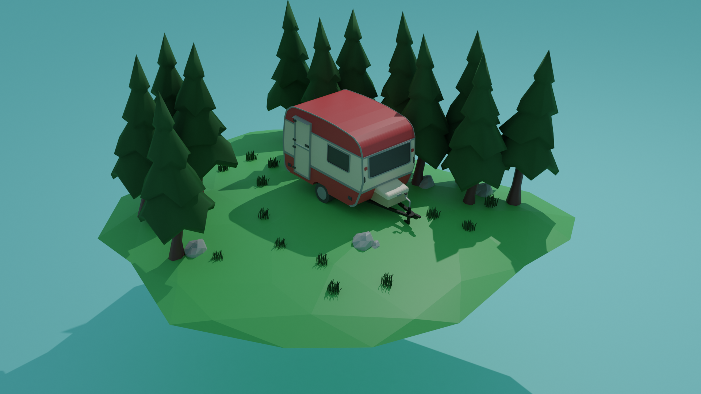
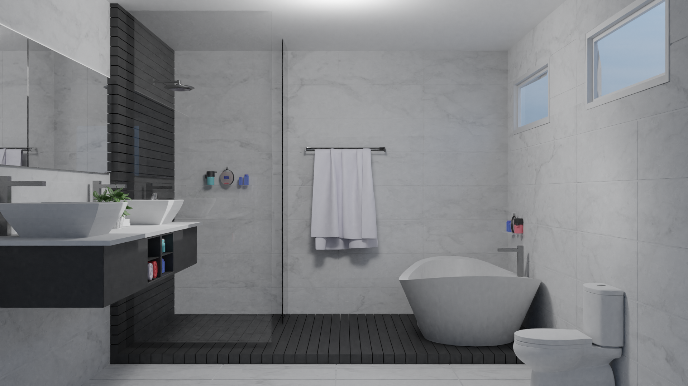
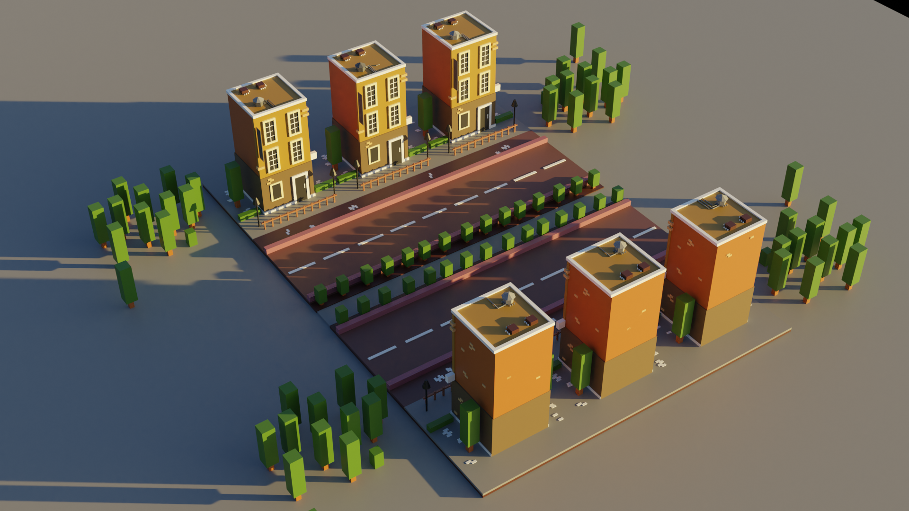

**01 - Donuts**
 
| Final        | Donut           | Coke  |
| ------------- |:-------------:| -----|
||||

Videos: [Blender 2.8 Beginner Tutorial Series](https://www.youtube.com/playlist?list=PLjEaoINr3zgEq0u2MzVgAaHEBt--xLB6U)
 

**02 - Isometric rooms**
 
| Living room| Office |
| ------------- |:-------------:|
| ||

Videos: [Blender Isometric Design : Room Low Poly](https://www.youtube.com/watch?v=H-8w9nxfMGE)

**03 - Carvan**

| Final        | Caravan side     |
| ------------- |:-------------:|
|||

Videos: Anyone

** 04 - Realistic Bathroom **

| Front        |   Side   |
| ------------- |:-------------:|
|||

Videos: [Blender architecture](https://www.blenderguru.com/tutorials/interior-architecture)

** 05 - CrossMind tutorial **

| Front        |   Side   |
| ------------- |:-------------:|
|||

Videos: [CrossMind](https://www.youtube.com/watch?v=e-fetDXDXX8&list=PLgO2ChD7acqH5S3fCO1GbAJC55NeVaCCp&ab_channel=CrossMindStudio)