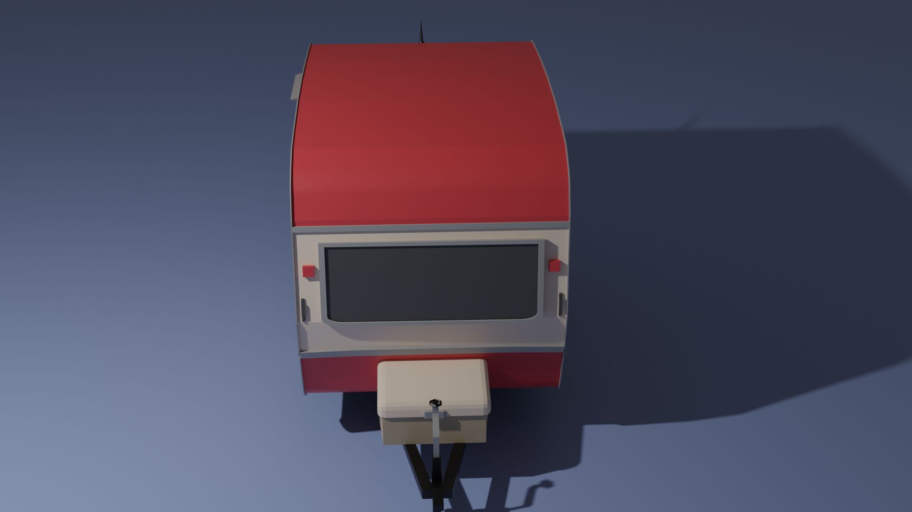

**01 - Donuts**
 
 | Final        | Donut           | Coke  |
| ------------- |:-------------:| -----|
||||

Videos: [Blender 2.8 Beginner Tutorial Series](https://www.youtube.com/playlist?list=PLjEaoINr3zgEq0u2MzVgAaHEBt--xLB6U)
 

**02 - Isometric**
 
| Living room| Bedroom |
| ------------- |:-------------:|
||||

Videos: Anyone